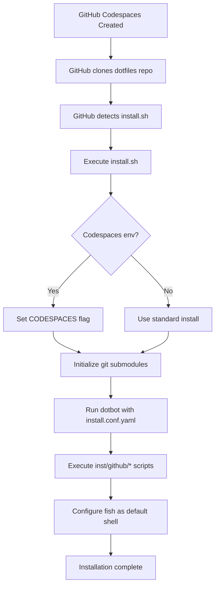

# Design Document

## Overview

This design creates a GitHub Codespaces-compatible `install.sh` script that serves as the entry point for automatic dotfiles installation in Codespaces environments. The script will detect the Codespaces environment, initialize the dotbot submodule, run the existing dotbot configuration, and execute platform-specific installation scripts for tools like fish, starship, autojump, and git-ai.

The design leverages the existing infrastructure (dotbot configuration and inst/github/* scripts) while adding a thin orchestration layer that follows GitHub's dotfiles conventions. This approach minimizes code duplication and maintains consistency across different installation contexts.

## Architecture

### High-Level Flow



### Component Interaction

The installation process involves three main layers:

1. **Entry Point Layer** (`install.sh`): Detects environment, initializes submodules, orchestrates installation
2. **Configuration Layer** (dotbot + `install.conf.yaml`): Creates symlinks, directories, and invokes tool installers
3. **Tool Installation Layer** (`inst/github/*`): Installs and configures individual tools

## Components and Interfaces

### 1. install.sh Script

**Purpose**: Main entry point that GitHub Codespaces will automatically execute.

**Location**: `./install.sh` (repository root)

**Responsibilities**:
- Detect if running in GitHub Codespaces environment
- Initialize git submodules (specifically dotbot)
- Execute dotbot with the install.conf.yaml configuration
- Handle errors gracefully with clear messaging
- Provide progress feedback

**Interface**:
```bash
#!/usr/bin/env bash
# Entry point: Called by GitHub Codespaces or manually
# Exit codes:
#   0 - Success
#   1 - General error
#   2 - Submodule initialization failed
#   3 - Dotbot execution failed
```

**Key Functions**:
- `detect_environment()`: Checks for $CODESPACES variable
- `init_submodules()`: Initializes git submodules for dotbot
- `run_dotbot()`: Executes dotbot with configuration
- `log_message()`: Outputs formatted progress messages

### 2. Enhanced install.conf.yaml

**Purpose**: Dotbot configuration that defines symlinks, directories, and tool installation commands.

**Current State**: Already exists and functional

**Required Changes**: None - the existing configuration already has conditional logic for GitHub environments using `if: test $GITHUB_USER || test $OS = "github"`

**Key Sections**:
- `create`: Directory scaffolding
- `link`: Symlink creation with platform conditionals
- `shell`: Tool installation via inst/github/* scripts

### 3. inst/github/* Scripts

**Purpose**: Platform-specific installation scripts for individual tools.

**Current State**: Already exist with Codespaces detection

**Scripts**:
- `inst/github/fish`: Installs fish shell via apt-get
- `inst/github/starship`: Installs starship prompt
- `inst/github/autojump`: Installs autojump directory navigator
- `inst/github/git-ai`: Installs git-ai via cargo
- `inst/github/set-default-shell`: Configures fish as default shell

**Required Changes**: Minor improvements to error handling and idempotency checks

**Common Pattern**:
```bash
#!/bin/bash
set -e
set -x

# Check if already installed (idempotency)
if command -v <tool> &> /dev/null; then
    echo "<tool> is already installed"
    exit 0
fi

# Detect Codespaces and install accordingly
if [ -n "$CODESPACES" ]; then
    # Codespaces-specific installation
else
    # Standard installation
fi
```

## Data Models

### Environment Detection

```bash
# Environment variables used for detection
CODESPACES          # Set by GitHub Codespaces
GITHUB_USER         # Set by GitHub Actions/Codespaces
OS                  # Can be manually set to override detection
```

### Installation State

The installation process tracks state through:
- File existence checks (e.g., `command -v fish`)
- Configuration file markers (e.g., grep checks in config files)
- Exit codes from subprocesses

## Error Handling

### Error Categories

1. **Submodule Initialization Errors**
   - Cause: Git submodule update fails
   - Handling: Display error message, exit with code 2
   - Recovery: User must check git configuration and network

2. **Dotbot Execution Errors**
   - Cause: Dotbot fails to create links or directories
   - Handling: Display error message, exit with code 3
   - Recovery: Check file permissions and existing files

3. **Tool Installation Errors**
   - Cause: Package manager fails, network issues, missing dependencies
   - Handling: Individual inst/* scripts handle errors, continue with other tools
   - Recovery: Retry installation or install manually

4. **Permission Errors**
   - Cause: Insufficient permissions for sudo operations
   - Handling: Display clear error message about sudo requirement
   - Recovery: Ensure Codespaces has proper permissions

### Error Handling Strategy

```bash
# install.sh error handling pattern
set -e  # Exit on error

function handle_error() {
    local exit_code=$1
    local error_message=$2
    echo "ERROR: $error_message" >&2
    exit $exit_code
}

# Example usage
git submodule update --init --recursive || handle_error 2 "Failed to initialize git submodules"
```

### Idempotency Guarantees

Each component ensures idempotency:

1. **Submodule initialization**: Safe to run multiple times
2. **Dotbot links**: Uses `relink: true` and `force: true` flags
3. **Tool installations**: Check for existing installation before proceeding
4. **Configuration files**: Use grep checks before appending

## Testing Strategy

### Manual Testing

1. **Fresh Codespaces Environment**
   - Create new Codespace with dotfiles repository
   - Verify automatic installation
   - Check all tools are installed and functional
   - Verify fish is default shell

2. **Re-run Installation**
   - Run `./install.sh` again in existing Codespace
   - Verify no errors occur
   - Verify no duplicate configurations

3. **Non-Codespaces Environment**
   - Run installation on local Linux machine
   - Verify fallback behavior works correctly

### Automated Testing

1. **CI/CD Integration**
   - Use existing GitHub Actions workflow
   - Test installation in Ubuntu container
   - Verify all tools install successfully

2. **Script Validation**
   - Use shellcheck for bash script linting
   - Verify executable permissions
   - Check shebang lines

### Test Cases

| Test Case | Expected Behavior | Verification Method |
|-----------|------------------|---------------------|
| Fresh Codespaces install | All tools installed, fish is default | Check `command -v` for each tool |
| Re-run install.sh | No errors, idempotent | Exit code 0, no duplicate configs |
| Missing sudo | Clear error message | Error message displayed |
| Network failure | Graceful degradation | Partial installation succeeds |
| Existing dotbot | Submodule update succeeds | Dotbot runs successfully |

## Implementation Notes

### Script Execution Order

1. `install.sh` runs first (GitHub Codespaces entry point)
2. Git submodules initialized
3. Dotbot executes with `install.conf.yaml`
4. Dotbot creates directories and symlinks
5. Dotbot runs shell commands in order:
   - `inst-starship`
   - `inst-fish`
   - `inst-git-ai`
   - `inst-autojump`
   - `inst-set-default-shell`
6. Fish loads and initializes

### Environment Variable Strategy

The installation uses environment variables for detection:

```bash
# Codespaces detection
if [ -n "$CODESPACES" ]; then
    # Running in Codespaces
fi

# Alternative detection for GitHub environments
if [ -n "$GITHUB_USER" ] || [ "$OS" = "github" ]; then
    # Running in GitHub environment
fi
```

### Logging and Feedback

```bash
# Progress logging
echo "==> Initializing dotfiles installation..."
echo "==> Detected environment: GitHub Codespaces"
echo "==> Installing fish shell..."
echo "✓ Installation complete!"

# Error logging
echo "ERROR: Failed to install fish shell" >&2
```

### Performance Considerations

- Use `--no-install-recommends` for apt-get to minimize installation time
- Run apt-get update once at the beginning, not for each package
- Use cargo-binstall for faster Rust tool installation
- Parallel installation not implemented (sequential is more reliable)

## Security Considerations

1. **Script Execution**: Only execute scripts from trusted sources (own repository)
2. **Sudo Usage**: Required for system package installation, user must have sudo access
3. **Network Downloads**: Use HTTPS for all downloads (starship, cargo-binstall, Fisher)
4. **File Permissions**: SSH directory created with mode 0700 (handled by dotbot config)
5. **Submodule Integrity**: Git submodules verified through git's built-in mechanisms

## Future Enhancements

1. **Parallel Installation**: Install independent tools concurrently
2. **Selective Installation**: Allow environment variables to skip certain tools
3. **Installation Profiles**: Different configurations for different environments
4. **Better Progress Reporting**: Progress bars or percentage completion
5. **Rollback Capability**: Ability to undo installation if something fails
6. **Caching**: Cache downloaded binaries to speed up reinstallation
