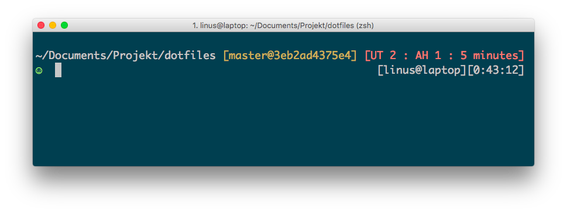

# Dotfiles

My binaries and configuration files for iTerm2, Atom, Zsh, Vim and Git.

## Install

1. Clone: `git clone https://github.com/oleander/dotfiles`
2. Install vcprompt and diff-so-fancy: `brew install vcprompt diff-so-fancy`
3. Edit `zsh/profiles` and `config/deploy.rb`
4. Install dependencies: `bundle install`
5. Load `iterm/com.googlecode.iterm2.plist` into iTerm
6. Deploy: `cap production deploy`